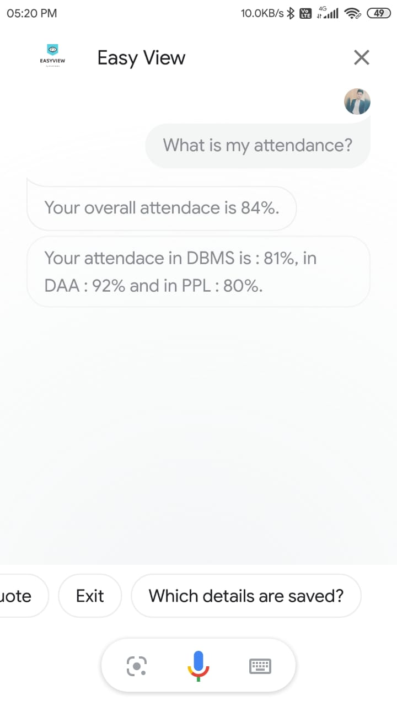

# EasyView_ERP 

The present age ERP with integrated Google assistant and interactive plots to get instant insights about the performance of students. Students can see the performance, faculties can easily compares result of different subjects, analyze
attendance etc. 
___

<h2 align="center" >Login Console</h2>

Login facility is provided to the Admin, Faculty and Students.

 

<h2 align="center" >Attendance Dashboard</h2>

Using attendance Dashboard, student can get one click insight about his attendance.

 

<h2 align="center" >Result Dashboard</h2>

Using result dashboard, student can get one click insight about his performance in class.

 
 

<h2 align="center" >Attendance Analysis for Faculty</h2>

Faculties can easily analyse attendance and send reminder to low attendance students.

 

<h2 align="center">Result Analysis for Faculty</h2>

Faculties can easily analyse result and get insights of performance of students in different subjects.

 

<h2 >Google Assistant Voice Commands</h2>

Faculties and students can give voice commands t the students to get the things done for them.

Student can ask assistant, OK Google, What is my attendance?

Google Assistant will reply with the attendance.

Faculty can ask assistant, OK Google, send reminder to short attendance students.

Assistant will send the reminder to all low attendance students.

